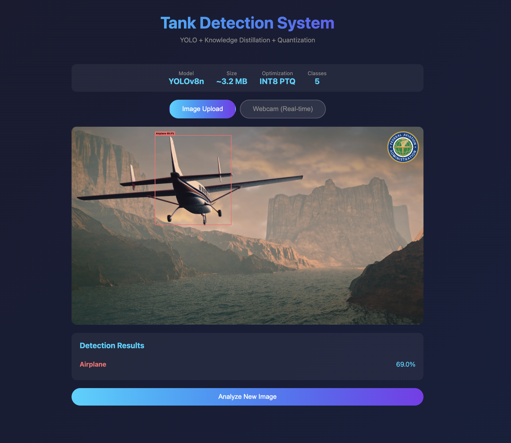
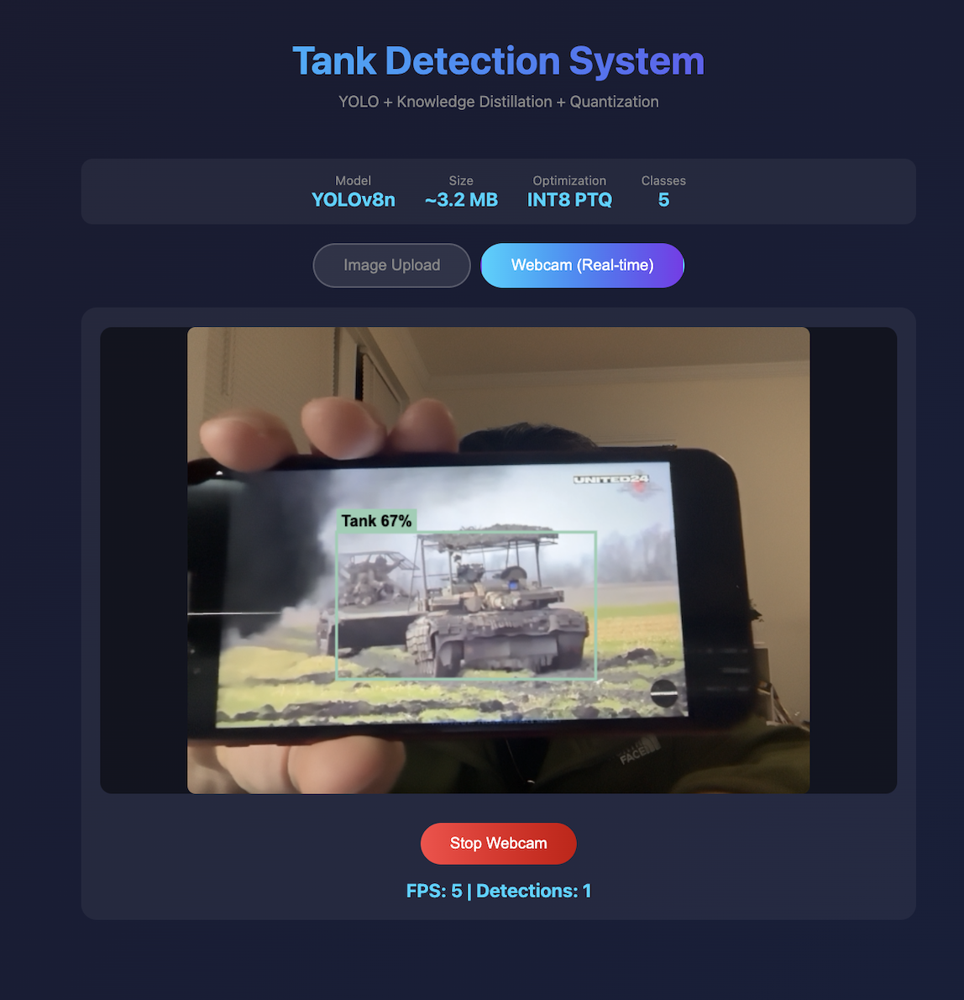

# YOLO Tank Detection - Knowledge Distillation & Quantization

Military object detection system optimized for mobile/edge deployment using Knowledge Distillation and Post-Training Quantization (PTQ).

## Project Overview

This project demonstrates model compression techniques for deploying YOLO object detection models on resource-constrained devices:

1. **Knowledge Distillation (KD)**: Transfer knowledge from large teacher model (YOLOv8m) to smaller student model (YOLOv8n)
2. **Post-Training Quantization (PTQ)**: INT8 quantization for further size reduction
3. **Web Deployment**: Browser-based inference using ONNX Runtime Web

---

## Evaluation Metrics Explained

### What is mAP (Mean Average Precision)?

Object Detection evaluates two things simultaneously:
1. **Classification**: Did we correctly identify the object class?
2. **Localization**: Did we correctly find where the object is?

**IoU (Intersection over Union)** measures localization accuracy:
```
IoU = (Area of Overlap) / (Area of Union)
```


### mAP50 vs mAP50-95

| Metric | IoU Threshold | Description |
|--------|---------------|-------------|
| **mAP50** | IoU >= 0.50 | Lenient - prediction box overlaps at least 50% with ground truth |
| **mAP50-95** | IoU >= 0.50, 0.55, ..., 0.95 | Strict - average mAP across 10 IoU thresholds |

**Example:**
- If your prediction box overlaps 60% with the actual object:
  - mAP50: Counted as correct (60% > 50%)
  - mAP75: Counted as incorrect (60% < 75%)
  - mAP50-95: Partially correct (passes 50%, 55% thresholds only)

**Why use both?**
- **mAP50**: Good for "Did we find the object?"
- **mAP50-95**: Good for "How precisely did we locate the object?"

---

## Results

### Complete Model Performance Comparison

| Model | Training Method | mAP50 | mAP50-95 | Parameters | Size |
|-------|-----------------|-------|----------|------------|------|
| YOLOv8m Pretrained | COCO only (no fine-tuning) | 5.37% | 3.54% | 25.9M | ~50 MB |
| YOLOv8n Pretrained | COCO only (no fine-tuning) | 3.64% | 2.15% | 3.0M | ~6 MB |
| **YOLOv8m Fine-tuned** | Tank Dataset | **86.40%** | **62.78%** | 25.9M | 49.6 MB |
| YOLOv8n Fine-tuned | Tank Dataset | 84.61% | 60.64% | 3.0M | 5.96 MB |
| YOLOv8n KD (Hinton) | Knowledge Distillation | 79.28% | 53.38% | 3.0M | ~6 MB |
| **YOLOv8n Quantized** | Fine-tuned + INT8 PTQ | **84.31%** | **60.50%** | 3.0M | **3.20 MB** |

### Key Findings

#### 1. Fine-tuning is Essential
- Pretrained (COCO) -> Fine-tuned (Tank): **~16x performance improvement**
- COCO-trained models cannot recognize military-specific classes without fine-tuning

#### 2. Fine-tuning vs Knowledge Distillation
| Approach | mAP50 | Analysis |
|----------|-------|----------|
| Fine-tuning | 84.61% | Ground truth labels provide direct supervision |
| Knowledge Distillation | 79.28% | Teacher's soft labels are indirect supervision |
| **Difference** | **-5.33%p** | Fine-tuning wins for this dataset |

**Why KD underperformed:**
- Object Detection benefits more from precise Ground Truth (Hard Labels)
- Teacher's errors propagate to Student
- KD is more effective when Teacher is significantly more accurate

#### 3. Model Compression Efficiency
- **Knowledge Transfer**: Student achieves 96.5% of Teacher's mAP50-95
- **Quantization Loss**: Only 0.30%p mAP50 degradation
- **Total Compression**: 15.5x smaller than original Teacher (49.6 MB -> 3.20 MB)

---

## Dataset

**YOLO Military Dataset** from Roboflow Universe

| Property | Value |
|----------|-------|
| Images | 3,181 (Train: 2,549, Valid: 631) |
| Classes | 5 (Airplane, Helicopter, Person, Tank, Vehicle) |
| Format | YOLO (txt labels) |
| License | CC BY 4.0 |

---

## Project Structure

```
yolo-tank-optimization/
├── data/
│   ├── train/images/          # Training images
│   ├── train/labels/          # Training labels (YOLO format)
│   ├── valid/images/          # Validation images
│   ├── valid/labels/          # Validation labels
│   └── data.yaml              # Dataset configuration
├── models/
│   ├── teacher/               # YOLOv8m trained models
│   ├── student/               # YOLOv8n trained models
│   └── optimized/             # Quantized ONNX models
├── scripts/
│   ├── 01_download_data.py    # Download dataset from Roboflow
│   ├── 02_train_teacher.py    # Train YOLOv8m teacher
│   ├── 03_distillation.py     # Student fine-tuning
│   ├── 03_kd_hinton.py        # Knowledge Distillation (Hinton method)
│   └── 04_quantize.py         # PTQ + ONNX export
├── web/
│   ├── index.html             # Web UI
│   ├── app.js                 # ONNX Runtime Web inference
│   └── models/                # Deployed ONNX model
└── README.md
```

---

## Pre-trained Models

All trained models are available on Hugging Face Hub:

**https://huggingface.co/Hunjun/yolo-tank-detection**

### Download Models

```python
from huggingface_hub import hf_hub_download

# Teacher model (YOLOv8m fine-tuned)
teacher_path = hf_hub_download(
    repo_id="Hunjun/yolo-tank-detection",
    filename="teacher/yolov8m_tank_best.pt"
)

# Student model (YOLOv8n fine-tuned) - Recommended for deployment
student_path = hf_hub_download(
    repo_id="Hunjun/yolo-tank-detection",
    filename="student/yolov8n_finetuned_best.pt"
)

# Quantized ONNX model (for web/edge deployment)
onnx_path = hf_hub_download(
    repo_id="Hunjun/yolo-tank-detection",
    filename="optimized/student_quantized.onnx"
)
```

---

## Quick Start

### Prerequisites

```bash
pip install ultralytics torch onnx onnxruntime roboflow huggingface_hub
```

### 1. Download Dataset

```bash
python scripts/01_download_data.py
```

### 2. Train Teacher Model (YOLOv8m)

```bash
python scripts/02_train_teacher.py --epochs 20 --batch 8
```

### 3. Train Student Model

**Option A: Fine-tuning (Recommended)**
```bash
python scripts/03_distillation.py --epochs 20 --batch 8
```

**Option B: Knowledge Distillation**
```bash
python scripts/03_kd_hinton.py --epochs 20 --batch 8 --temperature 4.0 --alpha 0.5
```

### 4. Quantize and Export

```bash
python scripts/04_quantize.py
```

### 5. Run Web Demo

```bash
cd web && python -m http.server 8080
```

Open http://localhost:8080 in your browser.

---

## Technical Details

### Knowledge Distillation (Hinton et al., 2015)

```
Loss = α × Hard_Loss + (1-α) × T² × KL_Divergence(Student_soft, Teacher_soft)
```

| Parameter | Value | Description |
|-----------|-------|-------------|
| Temperature (T) | 4.0 | Higher = softer probability distribution |
| Alpha (α) | 0.5 | Balance between hard and soft labels |
| Hard Loss | CE(Student, Ground Truth) | Standard detection loss |
| Soft Loss | KL(Student, Teacher) | Knowledge transfer loss |

### Post-Training Quantization (PTQ)

```python
from onnxruntime.quantization import quantize_dynamic, QuantType

quantize_dynamic(
    model_input="model.onnx",
    model_output="model_quantized.onnx",
    weight_type=QuantType.QUInt8
)
```

**Benefits:**
- FP32 -> INT8: ~4x size reduction
- Minimal accuracy loss (0.30%p mAP50)
- Faster inference on CPU/mobile devices

---

## Hardware

- **Training**: Apple M4 Pro (MPS backend)
- **Training Time**: ~30 min per model (20 epochs)
- **Inference**: Browser (ONNX Runtime Web - WASM backend)

---

## Web Demo

The web demo supports two detection modes:

### Image Upload Mode
Upload images for object detection with bounding boxes and confidence scores.



### Real-time Webcam Mode
Real-time object detection through webcam feed at ~5 FPS.



**Features:**
- Browser-based inference (no server required)
- INT8 quantized model (3.2 MB)
- Support for 5 classes: Airplane, Helicopter, Person, Tank, Vehicle

---

## References

- [Ultralytics YOLOv8](https://github.com/ultralytics/ultralytics)
- [ONNX Runtime](https://onnxruntime.ai/)
- [Knowledge Distillation (Hinton et al., 2015)](https://arxiv.org/abs/1503.02531)
- [YOLO Military Dataset](https://universe.roboflow.com/roboflow-100/military-object-detection)

---

## License

MIT License
